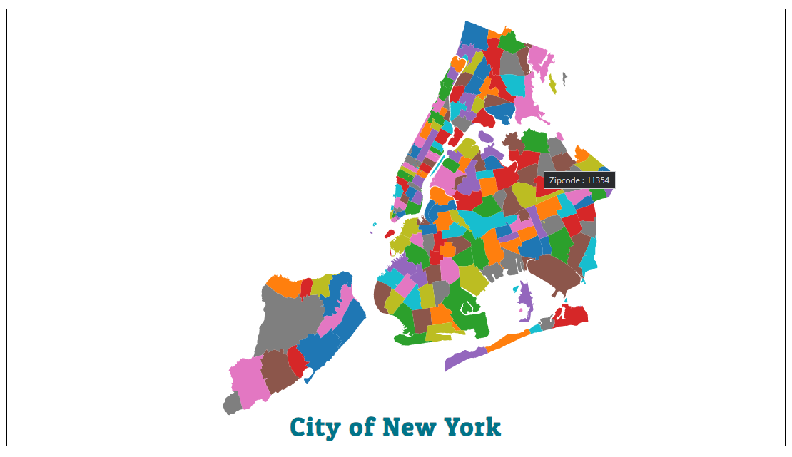
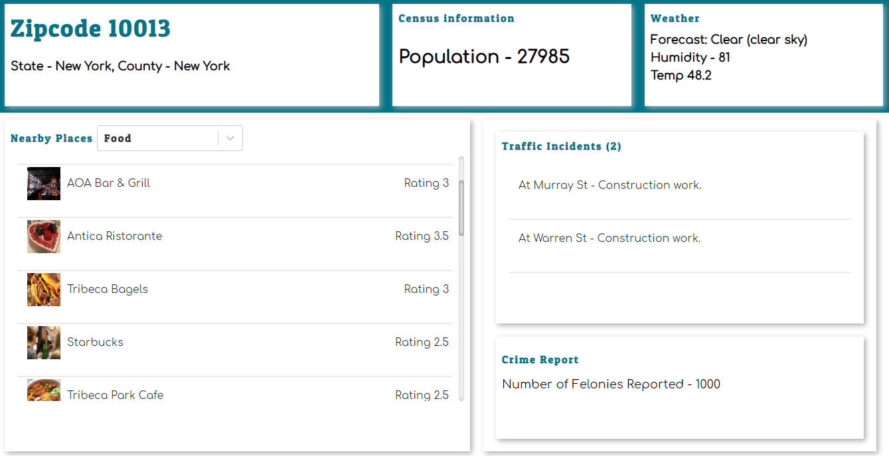

## This simple app can help you find details of an area (zip) in the city of New York.








## Project setup

### Clone the repository

```
git clone https://github.com/shashankdhar/react-zipexplorer.git
```

### Install dependencies 

```
npm install
```

### Run the app in development mode. Open http://localhost:3000 to view it in the browser.

```
npm start
```

### Builds the app for production to the build folder.

```
npm run build
```
